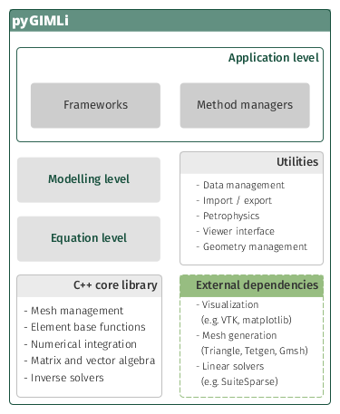

.. _sec:design:

Software design
===============

In applied geophysics, a lot of research efforts are directed towards the
integration of different physical models and combined inversion approaches to
estimate multi-physical subsurface parameters. Such approaches often require
coupling of different software packages and file-based data exchange. The idea
of pyGIMLi is to present a very flexible framework for geophysical modelling and
inversion, which allows standard and customized modelling and inversion
workflows to be realized in a reproducible manner.
levels.

The software is written in Python on top of a C++ core library, which allows a
combination of flexible scripting and numerical efficiency. pyGIMLi uses
selected external dependencies for quality constrained mesh generation in 2D
(:term:`Triangle`) and 3D (:term:`Tetgen`) and visualization in 2D
(:term:`Matplotlib`) and 3D (:term:`Paraview`) for example. For solving linear
systems we use the open-source collection :term:`SuiteSparse`
:cite:`ChenDavHag+2009`, which contains multi-frontal direct and iterative
solvers as well as reordering algorithms.

.. _fig:gimliblock:

pyGIMLi is organized in three different abstraction levels:

.. describe:: Application level

    In the application level, ready-to-use method managers and frameworks are
    provided. Method managers (:py:mod:`pygimli.manager`) hold all relevant
    functionality related to a geophysical method. A method manager can be
    initialized with a data set and used to analyze and visualize this data set,
    create a corresponding mesh, and carry out an inversion. Various method
    managers are available in :py:mod:`pygimli.physics`. Frameworks
    (:py:mod:`pygimli.frameworks`) are generalized abstractions of standard and
    advanced inversions tasks such as time-lapse or joint inversion for
    example. Since frameworks communicate through a unified interface, they are
    method independent.

.. describe:: Modelling level

    In the modelling level, users can set up customized forward operators that
    map discretized parameter distributions to a data vector. Once defined, it
    is straightforward to set up a corresponding inversion workflow or combine
    the forward operator with existing ones.

.. describe:: Equation level

    The underlying equation level allows to directly access the finite element
    (:py:func:`pygimli.solver.solveFiniteElements`) and finite volume
    (:py:func:`pygimli.solver.solveFiniteVolume`) solvers to solve various
    partial differential equations on unstructured meshes, i.e. to approach
    various physical problems with possibly complex 2D and 3D geometries.
